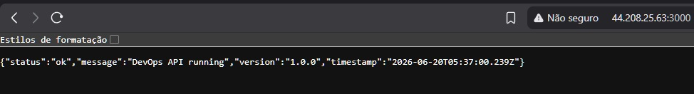
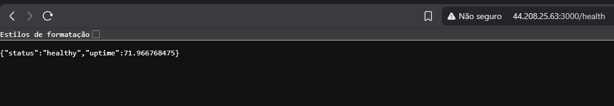
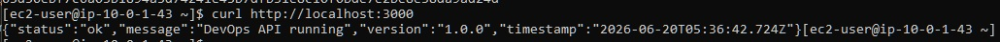

# devops-api

API REST containerizada com Docker, provisionada na AWS com Terraform e auditada com Devin AI.

## Stack

- **Node.js + Express** - API REST com endpoints de status e health check
- **Docker** - Containerizacao da aplicacao
- **Terraform** - Infraestrutura como codigo (IaC)
- **AWS EC2** - Hospedagem da aplicacao
- **AWS VPC** - Rede isolada com subnet publica, Internet Gateway e Route Table
- **AWS Security Group** - Controle de trafego de entrada e saida
- **Devin AI** - Auditoria de seguranca e boas praticas AWS

## Arquitetura

```
GitHub
   |
Terraform (IaC)
   |
AWS VPC (10.0.0.0/16)
   |
Subnet Publica (10.0.1.0/24)
   |
EC2 t3.micro (Amazon Linux 2023)
   |
Docker Container
   |
Node.js API (porta 3000)
```

## Endpoints

| Metodo | Endpoint  | Descricao              |
|--------|-----------|------------------------|
| GET    | /         | Status da API          |
| GET    | /health   | Health check da API    |

### Exemplo de resposta - GET /

```json
{
  "status": "ok",
  "message": "DevOps API running",
  "version": "1.0.0",
  "timestamp": "2026-06-20T05:36:42.724Z"
}
```

### Exemplo de resposta - GET /health

```json
{
  "status": "healthy",
  "uptime": 42.3
}
```

## Como executar localmente

Pre-requisitos: Docker instalado.

```bash
git clone https://github.com/IPedroHM/devops-api.git
cd devops-api

docker build -t devops-api .
docker run -p 3000:3000 devops-api
```

Acessa: http://localhost:3000

## Como provisionar na AWS

Pre-requisitos: Terraform e AWS CLI instalados e configurados.

```bash
cd terraform
terraform init
terraform plan
terraform apply
```

O output exibira o IP publico da EC2 e a URL da API.

## Como destruir a infra

```bash
cd terraform
terraform destroy
```

Todos os recursos AWS serao removidos e a cobranca encerrada.

## Infraestrutura provisionada pelo Terraform

- VPC com DNS habilitado
- Internet Gateway
- Subnet publica com IP publico automatico
- Route Table associada a subnet
- Security Group com regras de entrada (porta 22 e 3000) e saida liberada
- EC2 t3.micro com Amazon Linux 2023
- User Data configurando Docker automaticamente no lancamento da instancia

## Auditoria de Seguranca com Devin AI

O projeto passou por uma revisao de seguranca completa realizada com o **Devin AI**, agente autonomo de engenharia de software.

### Resultado da auditoria

- Nenhuma credencial exposta no codigo
- Nenhum secret ou access key hardcoded
- .gitignore protegendo arquivos sensiveis (.pem, .tfstate, .terraform/)

### Melhorias identificadas e aplicadas

| Severidade | Problema                                  | Correcao Aplicada                                  |
|------------|-------------------------------------------|----------------------------------------------------|
| Critica    | SSH porta 22 aberta para 0.0.0.0/0        | Recomendado uso do AWS Systems Manager             |
| Alta       | API porta 3000 exposta sem autenticacao   | Documentado para uso de ALB com WAF                |
| Media      | Key name hardcoded no Terraform           | Movido para variavel no variables.tf               |
| Media      | EBS sem criptografia                      | Adicionado root_block_device com encrypted = true  |
| Media      | EC2 sem IAM Role                          | Criado IAM Role com AmazonSSMManagedInstanceCore   |
| Media      | User data incompleto                      | Adicionados comentarios de deploy do container     |
| Baixa      | Security Group sem descricao              | Adicionado campo description                       |
| Baixa      | Sem VPC Flow Logs                         | Habilitado com CloudWatch Log Group                |
| Baixa      | Single AZ (sem alta disponibilidade)      | Criadas duas subnets em AZs diferentes (a e b)     |

### O que melhorar no proximo projeto

- Implementar GitHub Actions para CI/CD automatico de build e deploy
- Adicionar Application Load Balancer (ALB) na frente da EC2
- Configurar HTTPS com certificado SSL via ACM
- Substituir acesso SSH pelo AWS Systems Manager Session Manager
- Adicionar Prometheus e Grafana para observabilidade
- Usar AWS Secrets Manager para gerenciar segredos
- Implementar multi-AZ com Auto Scaling Group para alta disponibilidade

## Variaveis Terraform

| Variavel       | Padrao       | Descricao                    |
|----------------|--------------|------------------------------|
| region         | us-east-1    | Regiao AWS                   |
| instance_type  | t3.micro     | Tipo da instancia EC2        |
| project_name   | devops-api   | Prefixo dos recursos AWS     |
| key_name       | devops-key   | Nome do par de chaves SSH    |

## Seguranca

As credenciais AWS sao gerenciadas pelo AWS CLI local (`~/.aws/credentials`) e nunca expostas no codigo. Arquivos sensiveis estao protegidos pelo `.gitignore`:

```
*.pem
*.tfstate
*.tfstate.backup
.terraform/
.terraform.lock.hcl
```
## Preview

### API rodando na AWS



### Health Check



### Terminal EC2



## Autor

**Pedro Henrique Martins**
- GitHub: [IPedroHM](https://github.com/IPedroHM)
- LinkedIn: [ipedrohm](https://linkedin.com/in/ipedrohm)
